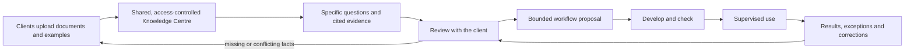
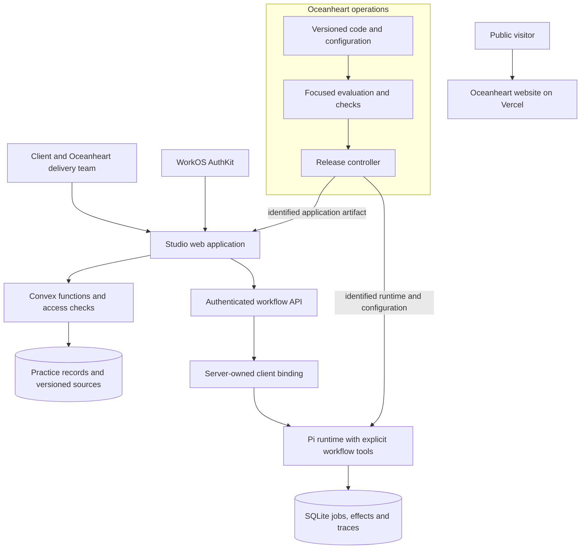
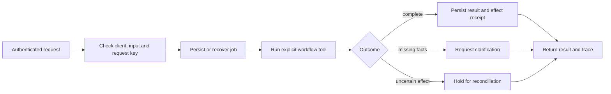
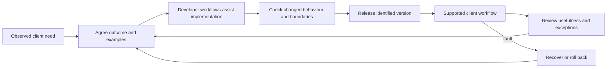

  

  <a href="https://www.oceanheart.ai">Website</a> ·
  <a href="https://www.oceanheart.ai/studio">Oceanheart Studio</a> ·
  <a href="https://www.oceanheart.ai/studio/case-study">Case study</a> ·
  

Oceanheart Studio is a workspace for developing and running useful agentic workflows with clients. Oceanheart operates the service and works alongside each client to understand their practice, build around the way they work, and improve the result through use.

The starting point is the client's operational knowledge: the documents, policies, examples and exceptions that explain how work actually gets done. The Knowledge Centre is being developed as a place for clients to upload and manage their operational documents, and for clients, Richard and authorised delivery agent teams to work from the same evidence. It helps them answer specific questions, identify what still needs asking, and turn that understanding into **Agentic Client Workflows**.

These are distinct from **Agentic Developer Workflows (ADWs)**, which help the engineering team build, test and maintain the software. Studio's immediate priority is supported client delivery. Product decisions will come from repeated work with real people before more of that process becomes self-service.

## From operational knowledge to a working service

A document is a source to consult, not permission to act. A useful answer should point back to the relevant passage and version. A proposed workflow should make its inputs, decisions and approval points clear enough for the client and delivery team to discuss before it runs.

The following diagram describes the delivery model. Document ingestion and shared retrieval are the current development priority; the whole loop is not yet an automated product feature.

The first delivery milestone is **one supported engagement**: a representative document set, reliable answers to real operational questions, and one narrowly scoped workflow reviewed with its owner. Client separation, source provenance and predictable replacement or deletion are prerequisites. A self-service platform is not.

## What is implemented

Studio already includes an authenticated practice workspace for clients, notes, services, bookings, enquiries and tasks. The existing knowledge features support versioned text sources, approval and bounded cited answers. These provide a starting point for the document-centred delivery workflow; they do not yet constitute a complete document ingestion service.

The workflow runtime supports durable jobs, explicit tools, traceable results and retry protection. Its first bounded workflow, Clara, prepares an invoice draft from validated session records and rate references. The private pilot demonstrates evaluation, activation and rollback of a supported rule change. It does not establish real-client billing or general autonomous reasoning.

Oceanheart's delivery team supplies the flexible interpretation and development work today. Arbitrary conversational requests do not automatically become released software. Mail and payment components have separate configuration and approval requirements; their presence in the repository does not mean they are enabled for an engagement.

## System architecture

The public website and Studio have separate release lines. Studio combines a web application and client-scoped backend with a bounded workflow runtime. The dedicated-instance path keeps runtime execution separate from the operator's provisioning and release authority.

Application records are subject to backend access checks. Dedicated workflow requests resolve a verified identity to a server-owned client binding. Provider administration and release credentials remain with the operator; the workflow runtime receives only the tools and authority it needs.

## Workflow execution

A workflow must remain understandable after a retry, interrupted connection or process restart. The runtime records the job and its outcome durably, with source and configuration references where the workflow requires them.

An existing effect receipt allows a retry to recover its result. External actions need their own provider-specific reconciliation; a successful model response is not evidence that an action occurred.

## Product iteration

Client work informs the product. The delivery team starts with a concrete problem and examples, makes a bounded change, and checks the behaviour that matters. Observed use supplies the next correction. Development agents assist this process; the team remains responsible for scope and release.

## Technology

| Layer | Stack | Responsibility |
| --- | --- | --- |
| Public website | React 19, vinext, Vite, Tailwind CSS, Vercel | Public site and writing, with a Hugo content archive |
| Studio application | Next.js 16, React 19, TypeScript, Chakra UI 3, Emotion | Authenticated workspace and server routes |
| Identity | WorkOS AuthKit, `jose` | Sessions and server-side identity verification |
| Application data | Convex | Records, source versions, queries and authorised mutations |
| Workflow runtime | Node.js 24, Pi SDK, TypeBox | Typed inputs and bounded tool execution |
| Durable execution | SQLite | Jobs, leases, retry keys, effects and traces |
| Verification | Node tests, browser checks, evaluation tooling, GitHub Actions | Behaviour checks and release evidence |
| Operations | exe.dev, Vercel, Git/GitHub, scoped credential adapters | Hosting, deployment and recovery |

## Repository

| Path | Contents |
| --- | --- |
| [`website/`](website/) | Public website application |
| [`content/`](content/) | Writing and Hugo source material |
| [`studio/`](https://github.com/rickhallett/oceanheart/tree/studio/dev/studio) | Studio application, Convex backend and operator bench on the Studio development line |
| [`docs/`](docs/) | Website delivery notes and shared assets |

Further technical context: [product direction](https://github.com/rickhallett/oceanheart/blob/studio/dev/studio/docs/PRODUCT-DIRECTION.md), [environment architecture](https://github.com/rickhallett/oceanheart/blob/studio/dev/studio/docs/HARNESS-ENVIRONMENT-SPEC.md), [operator bench](https://github.com/rickhallett/oceanheart/tree/studio/dev/studio/bench), and [environments](https://github.com/rickhallett/oceanheart/blob/studio/dev/studio/docs/ENVIRONMENTS.md).
