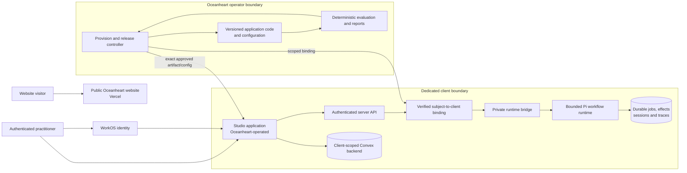
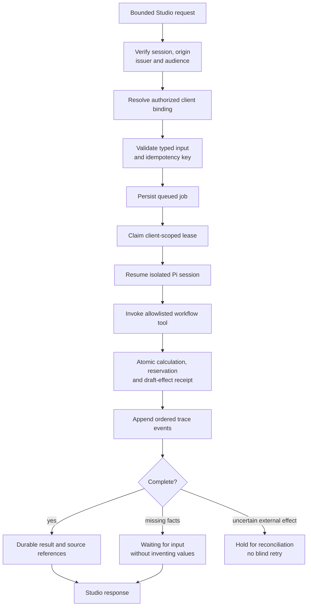
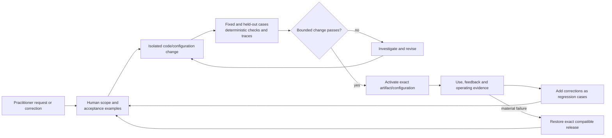

  

  <a href="https://www.oceanheart.ai">Website</a> ·
  <a href="https://www.oceanheart.ai/studio">Oceanheart Studio</a> ·
  <a href="https://www.oceanheart.ai/studio/case-study">Case study</a> ·
  

Oceanheart is Richard Hallett's practice and product studio. It brings together conversation, breathwork and work with the body, alongside the engineering of **Oceanheart Studio**: an Oceanheart-operated, maintained service for independent practitioners.

Studio is not packaged as software for practitioners to install or self-host. Oceanheart provisions and runs each engagement, shapes bounded workflows around the person's real practice, maintains the code and integrations, and remains responsible for evaluation, release and recovery.

## What Studio does

Studio gives practice work a private, coherent home: enquiries, bookings, client records, tasks, source-backed knowledge and carefully scoped assisted workflows. The current implementation includes an authenticated workspace, tenant-aware backend functions, durable workflow jobs and traces, explicit approval boundaries, and a dedicated-instance pilot.

The first complete workflow prepares invoice drafts from validated session records and explicit rate or cancellation-policy references. It does not send an invoice, collect money or infer missing attendance. This narrow effect surface is intentional: the service is being expanded from proved workflows rather than from a claim of general conversational automation.

Mail and payment components exist as separately guarded integrations, but they are not universally connected or enabled. Each client connection needs its own authorization, configuration and acceptance. Likewise, requesting a change is part of the maintained service today; a free-form conversation that automatically rewrites and releases arbitrary client software is not presented as an implemented capability.

## Deployed architecture and trust boundaries

The public website and Studio have separate release lines. The website is deployed from `main`. Current Studio development and acceptance live on [`studio/dev`](https://github.com/rickhallett/oceanheart/tree/studio/dev/studio); a dedicated client pilot additionally runs the Studio application and workflow runtime on Oceanheart-controlled infrastructure.

The browser does not select a client, secret or backend by supplying a path. Server-side identity is mapped to a controller-owned binding. The practitioner workflow has one explicit toolset and no default shell, package installation or extension discovery. Fleet credentials, backend administration and release authority remain outside that runtime.

## Durable request path

Workflow execution is a stateful system, not a single prompt-response call. The request is authenticated and validated before it becomes a durable job. Idempotency and effect receipts prevent a retry, process crash or browser disconnect from silently duplicating work.

The durable ledger and release record are the sources of truth. Pi session files preserve working context, while traces connect the actor, input and configuration versions, tool calls, result and status. External effects require their own idempotency and provider reconciliation rather than being inferred from a model response.

## Product iteration loop

Oceanheart Studio is designed as a maintained relationship: the practitioner explains what should change; Oceanheart turns that into a bounded, inspectable change; the exact evaluated version is activated; observed use becomes the next input.

The operator bench already supports versioned Clara configurations, evaluation reports, exact activation and compatible rollback. Turning every natural-language request into an autonomous code change is a direction for the service, not a claim about the current product.

## Technology and responsibilities

| Layer | Technology | Role |
| --- | --- | --- |
| Public website | React 19, vinext, Vite, Tailwind CSS, Hugo content archive, Vercel | Oceanheart's public site, writing and Studio product story |
| Studio application | Next.js 16 App Router, React 19, TypeScript 5.9, Chakra UI 3, Emotion | Authenticated practitioner workspace and server-side workflow boundary |
| Identity | WorkOS AuthKit and server-side JWT verification with `jose` | Session authentication and exact issuer/audience/subject checks |
| Practice data | Convex functions, schema and indexes | Client-scoped application records and server-authorized operations |
| Agent runtime | Node.js 24, Pi SDK 0.85.1, TypeBox, explicit custom tools | Resumable, bounded workflow sessions without default coding tools |
| Durable workflow state | Node's SQLite, filesystem permissions, immutable receipts and hashes | Jobs, leases, idempotency, effect reservations, traces and recovery |
| Evaluation and release | Deterministic Node tests, Promptfoo-compatible provider/configuration, JSON/HTML reports, GitHub Actions | Compare exact configurations, inspect traces and promote only identified artifacts |
| Operations | exe.dev, Git/GitHub, Vercel, scoped secret and provider adapters | Oceanheart-controlled instances, source provenance, deployment and rollback |

The accepted Studio implementation is documented on its release line: [product direction](https://github.com/rickhallett/oceanheart/blob/studio/dev/studio/docs/PRODUCT-DIRECTION.md), [harness and environment](https://github.com/rickhallett/oceanheart/blob/studio/dev/studio/docs/HARNESS-ENVIRONMENT-SPEC.md), [bench](https://github.com/rickhallett/oceanheart/tree/studio/dev/studio/bench), [environments](https://github.com/rickhallett/oceanheart/blob/studio/dev/studio/docs/ENVIRONMENTS.md), and [delivery evidence contract](https://github.com/rickhallett/oceanheart/blob/studio/dev/studio/docs/DELIVERY.md).

## Repository map

| Path | Purpose |
| --- | --- |
| [`website/`](website/) | Public React/vinext website source |
| [`content/`](content/) | Oceanheart writing archive and Hugo source material |
| [`studio/`](https://github.com/rickhallett/oceanheart/tree/studio/dev/studio) | Studio application, Convex backend, operator bench and release documentation on `studio/dev` |
| [`docs/`](docs/) | Website delivery notes and shared assets |

Production website: [www.oceanheart.ai](https://www.oceanheart.ai) · Studio overview: [www.oceanheart.ai/studio](https://www.oceanheart.ai/studio)
