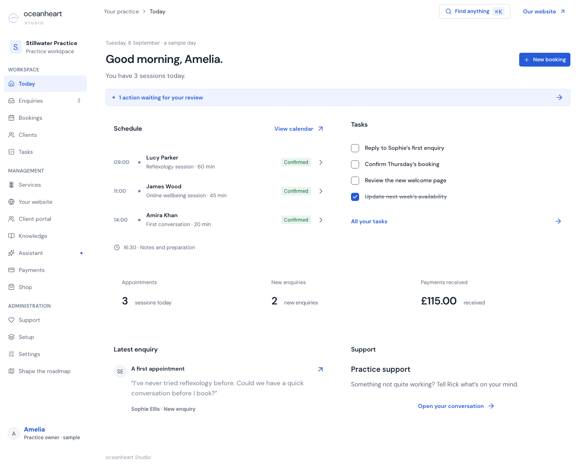

<p align="center">
  
</p>

<p align="center">
  <a href="https://github.com/rickhallett/oceanheart/actions/workflows/studio-verify.yml"></a>
  <a href="https://github.com/rickhallett/oceanheart/tree/studio/dev/studio"></a>
  <a href="https://github.com/rickhallett/oceanheart/tree/studio/dev/studio/src"></a>
</p>

Oceanheart is Rick Hallett's practice, bringing together conversation, breathwork and work with the body. This repository holds the [public website](https://www.oceanheart.ai), the writing archive, and **Oceanheart Studio**, a workspace being built for independent practitioners.

## Oceanheart Studio

Studio is being developed as a private space for agentic workflows configured, tested and maintained around an individual practitioner. The primary development target is a dedicated client instance and an agent workbench for adapting its context, instructions, integrations and behaviour. Read the [product direction](studio/docs/PRODUCT-DIRECTION.md), [eight mock-practitioner briefs](studio/docs/MOCK-CLIENTS.md), and [live landing-page copy audit](studio/docs/STUDIO-COPY-AUDIT-2026-09-11.md). These are development targets, not claims that dedicated provisioning is already available.

The prototype description below records an earlier stage; it is not a current hosted-capability inventory. Consult the dated release evidence before relying on it for deployment or acceptance status.



*The Today screen in the development prototype. All people, appointments and payments shown are fictional.*

[Try the Studio development demo](https://oceanheart-studio-env-staging-rick-halletts-projects.vercel.app/app).

The workspace is interactive and saves sample changes in the browser. Email, payments and assistant responses are simulated. A separate Convex backend implements tenant membership and booking foundations; it is not yet connected to the prototype. See the [demo journeys and boundaries](studio/PROTOTYPE.md).

## Run locally

Use Node.js 24. Studio development lives on `studio/dev`.

```sh
git clone --branch studio/dev https://github.com/rickhallett/oceanheart.git
cd oceanheart/studio
npm ci
STUDIO_PREVIEW=1 npm run dev -- --hostname 127.0.0.1 --port 4331
```

Open [localhost:4331/app](http://localhost:4331/app). The prototype needs no API keys. For build, browser checks and release steps, see [Studio development](studio/docs/DEVELOPMENT.md).

## Inside the repository

| Directory | Purpose |
| --- | --- |
| [`studio/`](studio/) | Next.js, React, TypeScript and Chakra UI practice workspace and Studio public pages |
| [`studio/backend/`](studio/backend/) | Independent Convex backend and integration tests |
| [`website/`](website/) | Public Oceanheart website, built with React and vinext |
| [`content/`](content/) | Hugo writing archive, retained alongside the public website |

[Style guide](studio/docs/STYLE_GUIDE.md) · [Roadmap](studio/docs/RAD-ROADMAP.md) · [Website build and release](docs/WEBSITE.md)
