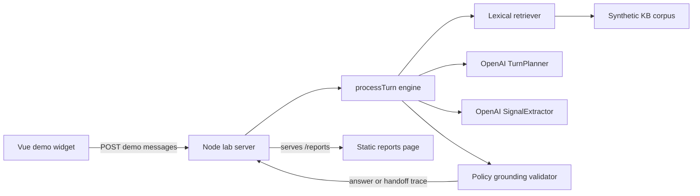

+++
title = "LoanSlam"
date = "2026-06-15"
description = "My own fail-closed conversation engine for a regulated lending domain, built after a 30-day Loans by MAL contract, as my vision of how it should work. An untrusted LLM proposes; deterministic code decides; every turn is audit-traced. Prototypal, over synthetic data."
tags = ["typescript", "llm-systems", "fail-closed", "regulated", "audit", "ai-safety"]
track = "client"
tier = "flagship"
weight = 10
status = "prototypal"
live = "https://x827e1872-production.up.railway.app/?devtools=true"
+++

## What it is

LoanSlam is a fail-closed conversation engine for a regulated lending domain. An untrusted language model proposes each turn; deterministic code decides what the customer actually sees. Every turn is audit-traced.

The design goal is narrow and unforgiving: let a model help customers in a domain where a wrong answer is a regulatory problem, not a bad review. So the model never gets the last word. The LLM is an untrusted planner. The compliance boundary is plain code.

This is an engine proof. The loop, the validator, the audit trace, and the test harness are built and inspectable. It is **prototypal, not customer-ready**: not productised, and not wired to any real data. There is a [live demo](https://x827e1872-production.up.railway.app/?devtools=true) you can drive and a [reports page](https://x827e1872-production.up.railway.app/reports) of evaluation runs, both over synthetic data. What I can show is the architecture and that synthetic-data console, not a production service.

## Provenance, and why it's the flagship

The work started as a 30-day contract for **Loans by MAL**. I delivered the contracted MVP inside that window; management then decided the project wasn't a fit for their requirements, and the contract ended. It shipped on time; they chose not to continue.

What this page describes is what I built **afterwards, on my own initiative**. The engine rebuilt from scratch the way I thought it should work, more ambitious than the original brief. Owning the whole loop solo, architecture, validators, audit trace, and test harness, with AI as the leverage, it came together in about three days. It is mine, independent of Loans by MAL.

I treat it as the flagship not because it is finished, but because it is the clearest statement of how I think regulated AI systems should be built: fail-closed by default, deterministic at the compliance boundary, and audited per message. Everything shown here runs over synthetic data, not real customer records.

## The architecture

One turn runs through a fixed pipeline:

The planner is an LLM. It reads the conversation and the retrieved corpus items and proposes a typed `TurnPlan`: an action, the UI primitive to render, any facts it collected, and the corpus items it claims to be citing. The plan is parsed against a Zod schema. Nothing past this point trusts the model.

The validator is plain code. It takes the proposed plan and runs it against hard rules. It can override the model's chosen action and record why. Every override carries the action it changed from, the action it changed to, and a reason code. The validator, not the planner, decides what the customer sees.

This is the split-brain: the model proposes, the code disposes. The interesting work is in the disposing.

## Fail-closed, concretely

The validator's default posture is refusal or handoff, not best-effort. Rules that are actually implemented:

- **Ungrounded answers are blocked.** An "answer" action only survives if it cites retrieved corpus items that are themselves marked answerable and the grounding is flagged as supported. No citation, no answer.
- **Forbidden credentials route to a human.** Any request for sort code, account number, IBAN, card number, CVV, or online-banking detail, whether it appears in the plan text or in the facts the planner collected, forces a handoff. The model cannot decide to collect them.
- **Account-specific promises are blocked.** Anything that reads as a balance, settlement figure, payment date, rate, APR, approval, or account change is overridden to handoff or fallback. The engine does not let the model commit to outcomes it cannot verify.
- **Vulnerability routing comes first.** A vulnerability signal pre-empts the normal flow and routes to human intake.
- **Prompt-injection is refused.** Attempts to bypass policy, impersonate staff, or extract system prompts, traces, or other customers' data are detected and answered with a safe fallback.
- **Serving-mode and UI/action mismatches are caught.** A plan that tries to answer from a corpus item flagged for handoff or exclusion is overridden; a UI primitive that does not match the action is dropped to fallback.

If the planner throws or returns malformed output, the engine substitutes a safe fallback response with the override code `malformed_plan`. A broken model degrades to a refusal, not to silence and not to a guess.

A few signals, oversharing of sensitive detail, a language barrier, an accessibility need, are captured as safety flags that feed routing and the trace rather than forcing a single hard action. Forbidden credentials are both a flag and a hard block.

## Per-message audit trace

Every turn writes a trace: the action the planner proposed, the action the validator finalised, every override with its reason code, the serving mode selected versus the one actually used, the safety flags raised, and the corpus items retrieved. The dev console renders all of it per turn.

This is the point of the design. In a regulated domain you have to be able to answer "why did the system say that" for any single message. The override record is the answer.

To be precise about maturity: the trace is rich, but there is no persistence layer, no ticketing webhook, and no real PII handling. Those are explicitly out of scope at this stage. This is an audited *engine*, demonstrated in a lab harness, not a deployed audited system.

## Built spec-first

The engine was built spec-first: typed contracts shared across the workspace, the validator's hard rules written against named policy patterns, and a per-turn trace contract that the console and the test harness both read. The discipline is what made the fail-closed guarantees checkable rather than aspirational.

The contracts are the load-bearing artifact. Four serving modes, seven turn actions, twelve safety flags, six UI primitives, all enumerated in shared Zod schemas, so the planner, the validator, the console, and the tests all agree on the same vocabulary.

## Shadow built, active routing in progress

The honest line here matters, because the obvious next feature is built but deliberately not switched on.

**Built and committed: shadow-mode signal extraction.** A second, faster model runs alongside the planner on every turn. It reads the conversation and emits a normalised `SignalBundle`: primary intent, a recommended serving mode, safety signals, retrieval hints, an uncertainty score, and a `negatedOrCorrected` flag. It runs in parallel under a real `AbortController` with a 10-second timeout, races against that timeout, and degrades gracefully to a `failed` or `timed_out` status without touching the turn. The model's permissive output is clamped and coerced into a strict shared contract before anything downstream sees it. Every turn then emits a comparison: what the signal recommended versus what actually happened, with reason codes. None of this changes behaviour. It is opt-in and trace-only, disabled unless an environment flag is set; the committed default path is the existing keyword retriever.

**In progress, uncommitted: signal-constrained active routing.** The next step, letting the signal actually filter and boost retrieval, and feeding it into validation so a clear `negatedOrCorrected` flag can stand in for brittle lexical matching, exists as working-tree changes governed by a written PRD. It is not shipped. I describe it as planned because that is what it is.

The reason for the move is documented honestly in the readiness work: the current routing is a regex-and-state-machine that proved brittle on weak or negated phrasing ("can't", "not complaining"), and the design is handoff-heavy by default. The shadow layer is the measurement step before changing the routing. Collect the recommended-vs-actual comparison first, then constrain on it. Regex stays for hard syntax, forbidden terms, and the credential and promise blockers; it is not being removed.

## The test harness

Two harnesses exist because correctness here is established by simulation, not production telemetry.

A **stochastic test simulator** generates scenarios across five behavioural axes, intent, persona style, journey shape, language noise, and risk marker, with seed-replayable randomness, so a failing run can be reproduced exactly. The persona styles include adversarial, vulnerable, and confused customers; the risk markers include forbidden-credential requests, hardship, and legal threats.

A separate **persona simulation harness** drives scripted journeys through the engine and captures the traces. Together they exercise the validator against the cases that matter: the customer trying to extract account data, the customer in hardship, the customer whose first message is a complaint dressed as a question.

## The dev console

A local dev console (a Vue app over a small Node HTTP server) drives sessions against the engine and surfaces the trace per turn: proposed action versus final action, serving mode, retrieved matches, the validator override count, and the safety flags. It is the inspection tool, the place where you can watch the model propose and the code override.

A scrubbed version of this console, running entirely on synthetic data with no client identifiers, is [live to drive](https://x827e1872-production.up.railway.app/?devtools=true). The mock loans page it runs against has been stripped of anything IP-sensitive. The [reports page](https://x827e1872-production.up.railway.app/reports) collects evaluation runs against the engine. These are real captured traces over synthetic data, never a faked demo.

## Stack

TypeScript (ESM, Node 24+), Zod for shared contracts, Vitest for tests, OpenAI Responses API with structured output for both the turn planner and the shadow signal extractor (separate models), a Vue dev console over a Node HTTP lab server.

## Confidentiality

The contracted MVP for Loans by MAL was private, proprietary work and is not shown here. What this page describes is my own post-contract engine, my IP, demonstrated entirely over synthetic data, with no client name attached to any record and no public repository. The live demo runs against a synthetic knowledge base only. Nothing here exposes Loans by MAL's data, code, or customers.

{{< claude-coach
  prompt="Read https://www.oceanheart.ai/projects/fail-closed-llm-engine/ and interrogate the architecture with me: where fail-closed validation could still leak, how the audit trace holds up under adversarial input, and what you would probe first in a design review."
  title="Interrogate this architecture"
  description="Open a Claude conversation primed to stress-test the fail-closed design with you: validators, audit traces, and where you would attack it first."
  action="Stress-test it with Claude" >}}
