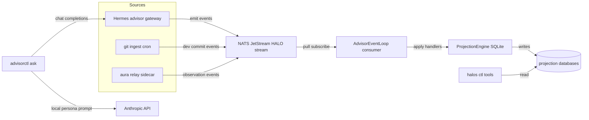

+++
title = "Halo"
date = "2026-04-10"
description = "Agent/tool-layer infrastructure: CLI modules with isolated stores and NATS event sourcing, so humans and agents drive the same tools through the same surface. Python, Docker, Kubernetes."
tags = ["python", "agents", "infrastructure", "nats", "event-sourcing", "kubernetes"]
track = "ai"
tier = "notable"
weight = 30
repo = "https://github.com/rickhallett/halo"
status = "personal infra"
+++

{{< claude-coach
  prompt="Read https://www.oceanheart.ai/projects/halo/ and interrogate the architecture with me: whether one CLI surface can safely serve humans and agents, how isolated stores and NATS JetStream interact, where event delivery or projection rebuilds could fail, and what you would probe first in a design review."
  title="Interrogate this architecture"
  description="Open a Claude conversation primed to examine the shared CLI contract, event stream, isolated stores, projections, and recovery boundaries."
  action="Discuss it with Claude" >}}

## What it is

A personal engineering tool layer. Halo is a set of small CLI modules, work tracking, memory, briefing synthesis, email triage, journaling, agent orchestration, each with an explicit command surface and its own isolated store. The design rule is that a human and an agent reach for the same tool the same way: there is no separate "agent API" bolted on after the fact, because the CLI *is* the API.

## Why it's built this way

Most agent tooling fails at the seams. The agent gets a bespoke integration, the human gets a different one, and the two drift. Halo collapses that. Every module exposes a typed CLI, writes to an isolated store, and emits events. An agent orchestrating a workflow and a person running the same command at a terminal produce the same effects and the same audit trail.

- **Isolated stores**, each module owns its data; no shared mutable god-state to corrupt.
- **NATS JetStream event sourcing**, actions are events, so state is reconstructable and the history is the source of truth.
- **Explicit CLI surface**, the contract is the command, discoverable and scriptable.

## Stack

Python, SQLite, NATS JetStream, Docker, Kubernetes. Getting an event-sourced multi-agent fleet running in a cluster when it ran perfectly on the laptop was its own education in everything that differs between local and production.

[GitHub &rarr;](https://github.com/rickhallett/halo)
