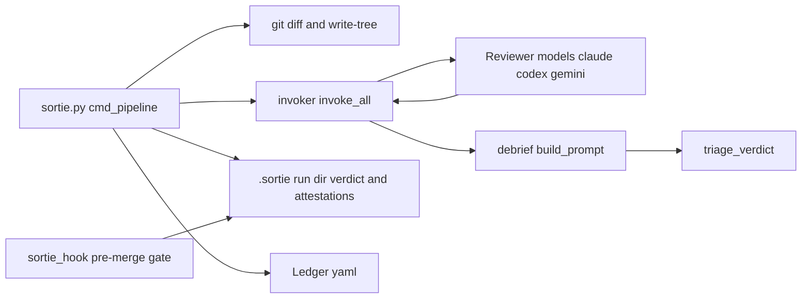

+++
title = "Sortie"
date = "2026-03-30"
description = "Async adversarial multi-model code review system. Parallel LLM fan-out, debrief synthesis with convergence analysis, severity-gated merge blocking. Python."
tags = ["python", "adversarial-review", "multi-model", "verification", "ai-augmented-development"]
track = "ai"
tier = "notable"
weight = 20
repo = "https://github.com/rickhallett/sortie"
summary = "adversarial multi-model review"
principle = "Different models have different blind spots. Make them check each other."
+++

## What it is

An async adversarial code review system for multi-agent development workflows. Sortie runs a configurable roster of language models (Claude, Codex, Gemini) against a worker's diff in parallel, synthesises their findings through a 4th-model debrief invocation, triages by severity, and gates worktree merges. All findings, dispositions, and cost data are captured in a structured ledger.

## Why it exists

Multi-agent swarm workflows produce code fast. They also produce unreviewed merges fast. The question isn't "did the code pass tests". It's "did independent reviewers with different blind spots converge on the same issues?"

The prior art survey found a range of tools implementing adversarial or multi-model review patterns. None of them combine all of: configurable model roster, parallel CLI invocation, 4th-model debrief synthesis with convergence analysis, severity-gated triage with configurable blocking, structured ledger for operational evaluation, and Claude Code hook integration.

## Origin: Darkcat pilot

Sortie grew out of the Darkcat adversarial review system I built inside [The Pit](https://github.com/rickhallett/thepit), a large, multi-phase project. Darkcat ran Claude, Codex, and Gemini against every code change as a pre-commit gate. The pilot data was what validated the approach: most findings were caught by only one model, with no false positives. That complementarity, each model family seeing things the others miss, is the empirical foundation for Sortie's design.

The Gauntlet (Darkcat's enforcement layer) required tree-hash-based attestations, manual walkthrough gates, and structured finding logs. Sortie generalises all of this into a configurable system that works outside The Pit's specific workflow.

## How it works



**Convergence analysis:** When 2+ models independently identify the same issue (despite different wording, line numbers, or framing), that finding is convergent, high confidence. A finding from only 1 model is divergent, logged as advisory, never blocks.

**Severity-gated triage:** Configurable `block_on` list in `sortie.yaml`. Default: convergent critical or major findings block the merge. Minor findings and all divergent findings are advisory only.

**Tree hash identity:** Artifacts are keyed to `git write-tree` output, not commit SHA. If the staged content changes after review, the attestation doesn't match and the merge is blocked.

## Architecture

```
scripts/
  sortie.py          # CLI: pipeline, status, dispose
  config.py          # Load sortie.yaml, resolve mode overrides
  identity.py        # Tree hash, run ID, cycle counting
  attestation.py     # Write/read/verify attestation YAML
  invoker.py         # Parallel model fan-out (ThreadPoolExecutor)
  debrief.py         # Synthesis prompt building, verdict writing
  triage.py          # Severity-gated verdict evaluation
  ledger.py          # Append-only YAML run data store
  sortie_hook.py     # Claude Code pre-merge gate

prompts/
  sortie-code.md     # Correctness, security, interface, error-handling, type-safety
  sortie-tests.md    # False-green, stub-fidelity, assertion quality, coverage gaps
  sortie-docs.md     # Accuracy, missing steps, stale references, contradictions
  debrief.md         # Cross-model synthesis, convergence scoring, unified verdict
```

Three review modes (code, tests, docs) with different rosters, triggers, and blocking rules. The debrief prompt receives all N model outputs and produces a unified finding list with convergence annotations.

## Research foundation

The design is grounded in research on cross-model verification, LLM-as-judge, and multi-agent debate:

- **Cross-family triad validated**. ReConcile (2024) showed models from different labs catch errors that same-family ensembles miss
- **Collaborative debrief over competitive debate**. ColMAD (2024) found structured collaboration outperforms adversarial debate for factual accuracy
- **Convergence threshold of 2**. Empirical evidence shows two-model agreement captures most real issues, with a third model adding only marginal gain
- **Divergent findings as advisory**. Free-MAD (2024) established that single-model findings are informative but unreliable as blocking criteria

Full survey: [landscape.md](https://github.com/rickhallett/sortie/blob/main/docs/landscape.md) · [research.md](https://github.com/rickhallett/sortie/blob/main/docs/research.md)

## Design principles

- **Legibility over magic**. Every step writes a YAML attestation; the operator can read the trail
- **Auditability over novelty**. Append-only ledger captures findings, dispositions, tokens, wall time
- **Evaluation over vibes**. The ledger exists to answer "is this process actually catching bugs?"
- **Constrained autonomy**. Models review independently but the triage decision is rule-based, not LLM-decided
- **Real traces over retrospective storytelling**. Attestations and ledger entries are written as the pipeline runs, not reconstructed after

[GitHub →](https://github.com/rickhallett/sortie)
