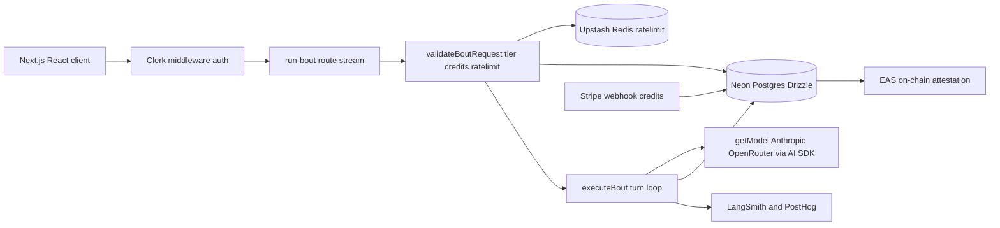

+++
title = "The Pit"
date = "2026-03-28"
description = "Multi-agent AI evaluation platform. Structured contests between agent configurations with observable traces, scoring, failure tagging, and cost visibility."
tags = ["typescript", "next.js", "evaluation", "ai-platform", "adversarial-review", "governance"]
track = "ai"
tier = "notable"
weight = 10
repo = "https://github.com/rickhallett/thepit"
live = "https://www.thepit.cloud"
status = "building eval engine"
+++

## What it is

A multi-agent AI evaluation platform built to make agent performance legible, comparable, governable, and economically inspectable. Structured contests between agent configurations with observable traces, explicit scoring, failure tagging, and cost visibility.

The platform demonstrates seven skill domains end-to-end: specification precision, evaluation and quality judgment, decomposition and orchestration, failure pattern recognition, trust and guardrail design, context architecture, and token/cost economics.

## The dual-layer thesis

The Pit operates on two tracks simultaneously:

1. **In-product governance**, how agents inside the platform are constrained, evaluated, and compared (run models, rubric-based scoring, failure taxonomy, cost ledger)
2. **On-product governance**, how development of The Pit itself is measurable, reviewable agentic engineering (spec-first PRs, adversarial review pipeline, dev-cost tracking, a logged chain of architectural decisions)

The product *is* the process. The process *is* the product.

## Current state

**Foundation (shipped):** Debate arena with SSE streaming, agent management, credit economy, Stripe billing, distributed caching (Upstash Redis), rate limiting. Technical debt roadmap completed: atomic transactions, error recovery, DAL extraction, env consolidation, dead code removal.

**Evaluation engine (Phase 1, on feature branches):**
- M1.1: Tasks table with branded `TaskId` type, domain module
- M1.2: Runs table with status enum (`pending` → `running` → `completed | failed`)
- M1.3: Contestants table with Zod validation
- M1.4: Execution engine with traces table and message builder

**Next (Phase 2):** Rubric schema, LLM-as-judge evaluator, scorecard with side-by-side comparison, 9-category failure taxonomy (`wrong_answer`, `partial_answer`, `refusal`, `off_topic`, `unsafe_output`, `hallucination`, `format_violation`, `context_misuse`, `instruction_violation`).

**Then (Phase 3):** Cost ledger with microdollar accounting, score-per-dollar economics endpoint, MVP UI.

## The codebase review model

Before building the evaluation engine, I ran a 6-layer systematic review of the existing codebase, treating technical debt exposure as the actual interview preparation:

| Layer | What it audits | Key finding |
|-------|---------------|-------------|
| L1, Dependency boundary | Import graph, circular deps | `bout-engine.ts` is the nexus (24 incoming deps) |
| L2, API surface | Route handlers, domain modules | Clean 2-function API with tagged union boundary |
| L3, Error paths | Exception handling, failure modes | Double-fault chain in logging catch block; preauth-settle gap |
| L4, State management | Server + client state mapping | Drizzle ORM with explicit schema; React hooks with PostHog observability |
| L5, Change impact | Propagation analysis | Full cross-reference of routes → components → tests |
| L6, Slop detection | Anti-pattern annotations | Deferred (backreferences to Tells taxonomy) |

L3 findings directly motivated the transactional integrity standardisation, a `DbOrTx` pattern applied across the multi-step database operations.

## Process infrastructure

**The Gauntlet:** Every commit passes through gate (typecheck + lint + tests) → Darkcat adversarial review (Claude + Codex) → Pitkeel stability check → human walkthrough. Tree-hash-based attestations.

**Darkcat triangulation:** Multiple model families review the same change, and findings caught by a single model surface gaps the others miss. This pattern motivated building [Sortie](/projects/sortie/) as the generalised version.

**Decision chain:** Architectural decisions are logged across the full project history. Standing orders include: truth-first, immutable historical records, agent-minute estimation, discipline beats swarm.

## Stack

Next.js 16, TypeScript (strict), React 19, Drizzle ORM, Neon Postgres, Clerk auth, Stripe payments, Vercel AI SDK, Upstash Redis, PostHog, Sentry.

[GitHub →](https://github.com/rickhallett/thepit)
