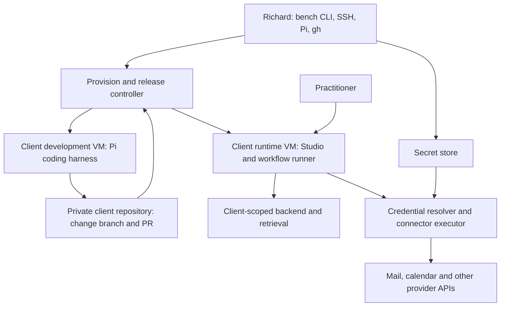

# Dedicated Studio instances: harness, environment and credentials

Status: implementation specification, 11 September 2026. Owner: Richard Hallett. Pi and exe.dev are selected by the product owner. Recommendations below are proposed engineering defaults; no infrastructure or credentials have been provisioned. Implements the direction in [PRODUCT-DIRECTION.md](PRODUCT-DIRECTION.md), using [MOCK-CLIENTS.md](MOCK-CLIENTS.md). Work tracking: [RIC-136: instances](https://linear.app/tinyrick/issue/RIC-136), [RIC-137: workbench](https://linear.app/tinyrick/issue/RIC-137), RIC-138: first workflow, RIC-139: adaptation.

## 1. Outcome and decisions

Oceanheart can provision a practitioner's Studio, resume its dedicated Pi agent, develop an adaptation, evaluate it and serve a known version. The practitioner can use workflows and ask for changes without operating a coding harness. Richard can work directly at the bench through SSH, Pi and gh, with contextual links to runs and evidence.

| Area | Decision or proposed default | Reason |
| --- | --- | --- |
| Harness | **Selected: Pi**, pinned to an exact tested release | Extensible coding environment; one harness for development and embedded agent sessions |
| Compute | **Selected: exe.dev**, Oceanheart-controlled VMs | Dedicated persistent environments with simple SSH operations |
| Code | **Recommended: private repository per real client**, branches per change | A Git branch is a versioning unit, not an access boundary |
| Initial mock code | Same repository structure as real clients; all data fictional | Exercises provisioning and access honestly |
| Workbench | Thin TypeScript CLI plus Pi SDK adapter, Git/gh and local evaluation reports | Avoid a separate dashboard or second agent orchestration framework initially |
| Git credentials | Try exe.dev's per-repository VM integration first | Documented git and gh support without persistent GitHub tokens on the VM |
| Secrets | Recommend 1Password for operator/bootstrap secrets; per-client runner access and encrypted OAuth records | Avoid personal-vault credentials and raw tokens in the agent's context |
| Data | Retain Studio's existing backend contract; provision a separate backend environment for each client initially | Avoid combining the first harness experiment with a database rewrite |
| Deployment | exe.dev runs Studio web/server and agent services; backend may remain managed | Dedicated does not require every service to live on the same disk |

Pi's SDK supports embedded sessions, event subscriptions and configurable tools; its extension system supplies custom tools and hooks. The adapter must use the exact tested package API rather than assume compatibility with another Pi release. [SDK](https://github.com/earendil-works/pi/blob/main/packages/coding-agent/docs/sdk.md), [extensions](https://github.com/earendil-works/pi/blob/main/packages/coding-agent/docs/extensions.md).

exe.dev documents persistent Linux VMs and HTTPS forwarding. Its CPU/RAM allowance is pooled across VMs: two client instances do not imply twice the available capacity. Size and concurrency must be measured against the current account before provisioning. No current subscription, capacity or price is asserted here. [Overview](https://exe.dev/docs/all), [capacity](https://exe.dev/docs/billing/usage).

## 2. Environment topology



Logical components may share a service process where this does not collapse a required permission boundary. The provision/release controller starts as a CLI on Richard's trusted computer. It holds fleet authority; no client agent gets the exe.dev account key or fleet-wide credentials.

Use one persistent runtime VM per client, plus a separate development VM allocated while coding is underway. Development state is resumable; the development VM can remain idle between sessions or be recreated from its repository and saved private agent state. Never clone a used client VM to create a different client.

Two execution profiles are explicit:

- **Builder:** Pi has shell/code tools in the development VM, its client's change branch, synthetic data and development credentials. It can build bespoke code. It has no production secret-store root, production database administration or release-controller authority.
- **Practitioner workflow:** Pi is embedded behind Studio with an explicit registered tool set and resource loader. No default shell, arbitrary filesystem tool, package installation or user-supplied extension discovery. Connector authorization is enforced outside the model. A request to change code becomes a linked builder job; it does not unlock shell access in the runtime session.

These profiles are the same client relationship with different capabilities. Isolation depends on VM/process/service permissions and external authorization, not the system prompt. The pilot must prove the workflow profile does not silently load default tools, global extensions or a personal Pi configuration. Runtime code remains powerful once released; authorised code promotion is an explicit transfer of trust.

Stop Pi processes when idle; persist sessions and queued work. Keep the runtime web endpoint and a small job supervisor available for requests and incoming events. Do not claim a stopped VM wakes on HTTP or that stopping a process eliminates subscription costs. VM suspension/wake behaviour is a separate provider spike if later required.

## 3. Repository and release model

Use opaque client IDs such as `c0001`; keep the mapping to a real practitioner in the private registry. Proposed client repo names are `studio-c0001`. Client repositories must be private. Confidential documents, session histories, databases and secrets are outside Git even in private repositories.

The template starts as a reviewed export of the Studio application and required shared files from the accepted Oceanheart source. Do not copy the entire website/career repository and its history into client repos. Prove the export builds independently before making it the provisioning source. Record origin repository, exact source SHA, export script version and template version.

Prefer an independently created private repository over a GitHub fork for the first version. The controller can use `gh repo create --private --source ... --push` against a prepared export; this is an operation shape, not a provision command run by this spec. GitHub also offers repository-template creation, but the immutable source must still be recorded. [gh repo create](https://cli.github.com/manual/gh_repo_create).

Within each client repository:

- `main`: accepted client code; protection/rules appropriate to the available GitHub plan.
- `change/<request-id>`: one bounded adaptation, created from the exact current release source.
- `release/<version>`: immutable tag recorded with commit and artifact digest.
- A PR records the client request, behavioural change, relevant eval comparison and artifact. `gh pr create`, `gh pr checks` and `gh pr view` support the bench. Release authority stays with the controller/Richard initially; a successful agent run does not release itself.

Deploy an immutable artifact by digest into a new release directory and switch the runtime only after readiness checks. Never `git pull` into the running application. Store previous artifact/configuration references for rollback. Record database compatibility separately: reverting code cannot undo an incompatible data migration. Begin with additive or backward-compatible data changes and explicit migration receipts.

Template improvements become reviewed patches or versioned packages applied through a client branch and its cases. Independently created repos may not share useful ancestry, so do not promise automatic upstream merges. Harvest reusable changes without client material; never merge a client repository wholesale into the template. A package/module system can evolve after repeat patterns appear.

## 4. exe.dev provisioning contract

The proposed `studio-bench` CLI is **not yet implemented**. It wraps verified provider operations instead of exposing arbitrary agent-generated provisioning commands.

Lifecycle: `planned -> allocating -> bootstrapping -> configured -> ready`; failures retain their phase and resumable receipt. Runtime can be `degraded`, `paused` (jobs disabled) or `retired`. A failed HTTP response must not cause a second VM/repository to be created blindly.

Every provision operation has an idempotency key, client ID, manifest hash and registry entry. Serialize provisioning for a client. Before retrying an uncertain operation, query provider/GitHub state and reconcile ownership. Capture returned VM identifiers and `ssh_dest`; do not construct SSH identities from names or disable host checking.

Provision sequence:

1. Resolve the immutable template and check private-repo ownership, current exe.dev capacity and existing registry state. Produce a resource/action plan.
2. Create the private client repository and exact initial commit, then the runtime and development environment records.
3. Create VMs from a secret-free pinned software image or verified bootstrap. `new --json` and setup scripts are documented; check current CLI help at implementation time. No secrets in `--env`, setup script text, image layers or command arguments. [VM creation](https://exe.dev/docs/cli-new).
4. Install pinned runtime dependencies and release artifact; establish distinct service users, persistent directories and startup/restart supervision. Do not give the workflow user sudo or access to a container daemon socket.
5. Attach only explicitly requested integrations; verify inherited/default integrations, shares and reachable privileged services before readiness. Native provider conveniences must not grant a client VM the operator's unrelated capabilities.
6. Provision backend identity/data mapping and credential references. Inject only the necessary bootstrap secret through authenticated SSH stdin into a protected file, with command tracing disabled; record receipt metadata, never the value.
7. Configure the single intended web entry point and verify authentication and client mapping. Record public URL, internal port, artifact/config hashes and source version.
8. Run the acceptance probes; mark ready only when each required resource and boundary is confirmed.

An unauthenticated golden VM may be copied after a deliberate cleanliness audit. A populated runtime/development VM is not a template: `cp` copies a VM and is not a sanitisation mechanism. Verify integration/sharing state after any copy. [VM copying](https://exe.dev/docs/cli-cp).

Suggested runtime layout: `/opt/studio/releases/<digest>` for immutable artifacts; `/var/lib/studio` for run/job state; `/var/lib/studio-pi` for private session state; `/run/studio-secrets` for temporary injected material where supported. Development uses a separate checkout and data directory. Exact users, file modes and systemd/container startup are verified in the first image spike.

## 5. Instance manifest and private registry

The manifest is schema-versioned and contains references, not secret values. This example is illustrative, not a valid provision request: placeholders must fail executable validation.

```json
{
  "schemaVersion": 1,
  "clientId": "c0001",
  "mode": "synthetic",
  "template": {"version": "<version>", "sourceSha": "<full-sha>"},
  "code": {"repository": "<owner>/studio-c0001", "releaseSha": "<full-sha>"},
  "runtime": {"provider": "exe.dev", "vmId": "<returned-id>", "artifactDigest": "<digest>"},
  "harness": {"kind": "pi", "version": "<exact-version>", "profile": "workflow"},
  "configuration": {"instructionsVersion": "<sha>", "toolsetVersion": "<sha>", "modelProfile": "<profile>"},
  "data": {"backendRef": "<client-backend>", "retrievalRef": null},
  "credentials": {"model": "secretref://c0001/runtime/model", "mail": null},
  "limits": {"maxConcurrentRuns": 1, "maxRunSeconds": 180, "maxToolCalls": 30},
  "evaluationSet": "mock-clients/CL"
}
```

The registry binds authenticated practitioner IDs to client IDs, repository IDs, VM identities, backend environments, secret references and deployment receipts. Client requests never choose a tenant or secret by supplying a path. Resolve it from server-side identity. Record source revision, model/provider identity, prompt/toolset versions and capability profile on each run. Limits above are proposed pilot limits to tune, not provider guarantees.

## 6. Credential provision and management

Credentials have owners, scopes, expiry/rotation metadata and lifecycle states: `pending`, `active`, `expired`, `revoked`, `needs_reconnect`. The private registry stores metadata and references only. Treat development and runtime credentials as different installations even for the same client.

| Credential | Held by | Supplied to | Required boundary |
| --- | --- | --- | --- |
| exe.dev account SSH key | Trusted operator/controller | Provider control plane | Never copied to a client VM or agent session |
| Git repository capability | Per-repo exe.dev integration, or scoped GitHub App | Client development VM; runtime read-only only if needed | No other client repositories; no admin/release bypass |
| Secret-store bootstrap token | Protected runtime resolver identity | Credential resolver only | Per client and environment; no personal/all-vault token |
| Model API credential | Per-client/project scope where provider supports it | Model transport, not tool output | Usage attributable; budgeted; token never appears in prompts |
| Mail/calendar OAuth tokens | Encrypted client connection store | Connector executor | Granted provider account/scopes bound to authenticated client |
| Backend deploy/admin key | Controller | Reviewed deployment operation | Not available to practitioner workflow tools |
| Backup decryption/recovery key | Operator-controlled secret store | Restore operation | Not stored alongside a public artifact or sole backup |

### Recommended secret-store starting point

Use 1Password for operator-controlled infrastructure credentials, static API keys and bootstrap encryption material if the current account supports suitable service accounts at an acceptable cost. Its documentation describes vault/action-scoped service accounts and access reporting. Check actual account entitlement and scale limits before selecting it operationally. No vault was accessed for this spec. [1Password service accounts](https://www.1password.dev/service-accounts).

Use separate client/environment vaults or an equivalent enforcement boundary. A separate read-only service identity retrieves only that environment's required items. Bootstrap that identity over verified SSH; never type it into chat or bake it into a cloned VM. Keep the service identity outside Pi's readable filesystem/process context. Running Pi and the resolver as the same Unix user defeats that claim; root on the runtime remains trusted.

At first, the resolver can be a small local service with an authenticated Unix socket and an allowlisted credential-to-operation mapping. Pi asks to perform a typed operation such as `mail.listEnquiries`; it cannot ask to retrieve an arbitrary secret. Model credentials are consumed inside the trusted transport. The resolver must never echo secret material to a trace.

If 1Password entitlement is unsuitable, preserve a narrow `SecretStore` interface and select another store supporting scoped machine identities, rotation and export. Do not build a bespoke cryptographic vault. Encrypted files can support a synthetic/manual bootstrap, but are not automatically a complete production rotation and OAuth-management system.

### OAuth connections

Store rapidly changing refresh/access tokens in an encrypted connection store, with the encryption key obtained from the secret store; do not use Git or prompts as the token database. Records include client/environment, provider subject/account identifier, granted scopes, expiry, token version and encryption-key version.

Connect flow: authenticated practitioner starts connection -> server binds state to client/session with expiry and one-time use -> provider consent (PKCE where supported/required) -> callback validates state and account -> encrypted record -> harmless identity/capability probe -> active receipt. No mailbox migration or password collection is required. Provider OAuth-app registration and consent verification are prerequisites to actual mailbox integration, not assumed complete.

Serialize refresh per connection using a lease/version check so rotated refresh tokens are not overwritten. On revocation, stop new dependent jobs and ask for reconnection. Rotation replaces the item/record, reloads its consumer and probes capability; a failed rotation leaves an explicit degraded state. Offboarding revokes provider grants where supported, secret-store identities and VM/repo integrations, then exports/retains/deletes records under the engagement's agreed policy.

### GitHub authentication choice

exe.dev documents per-repository integrations attached to a VM, read-only mode, and `gh` through `GH_HOST=github.int.exe.xyz`. Prefer this to copying Richard's personal GitHub login. Test clone, push-to-change-branch and PR operations through the integration; API support and branch-rule compatibility are acceptance tests, not assumptions. Avoid `--act-as-user` as the default so agent activity keeps its own attribution. [exe.dev GitHub integration](https://exe.dev/docs/integrations-github).

If that route cannot enforce the needed scope or support gh operations, use an Oceanheart GitHub App. Mint repository- and permission-restricted installation tokens on the controller; GitHub documents one-hour expiry. The app signing key stays off client VMs. Provide the short-lived token through the process environment/credential helper only for the operation, without logging it. Repo creation remains a controller privilege. [GitHub installation tokens](https://docs.github.com/en/apps/creating-github-apps/authenticating-with-a-github-app/generating-an-installation-access-token-for-a-github-app).

## 7. Studio, identity and backend integration

Keep the existing Next.js Studio interface as the presentation foundation. Running it on exe.dev requires validating build output, start command, reverse-proxy headers and environment configuration. Preserve existing authentication/backend contracts until a replacement is justified by the dedicated-instance pilot.

Recommend separate Convex client deployments/projects initially, subject to practical account limits/costs. WorkOS client identity must map to the intended instance: verify callback/redirect configuration and server-side authorization for every URL. Do not copy today's production backend/admin keys or point mock instances at the existing production database. A dedicated frontend VM using the old shared backend without a deliberate access model is insufficient evidence of dedicated data.

For initial operator-only synthetic checks, retain exe.dev's private proxy. For practitioners, choose between documented web-only provider access and application authentication on the intended public app port. Provider web access must not grant root, shell, Pi or developer service access. Verify alternate proxied ports as well as the main URL before granting web access. Do not combine two login systems without a clear need. OAuth callbacks and webhooks must be reachable through the chosen ingress mode. [exe.dev sharing](https://exe.dev/docs/sharing).

Binding a service to loopback is not alone a guarantee it is unreachable through provider forwarding. Keep Pi RPC, development terminals and credential endpoints off exposed proxy ports; prefer stdin/stdout or Unix sockets. Only the application API accepts practitioner requests.

## 8. Pi adapter, jobs and trace contract

Implement a small adapter around Pi: `startRun`, `resumeSession`, `cancelRun`, `subscribeEvents`, `exportTrace`. These are Oceanheart interface names, not claimed Pi SDK methods. The runtime supplies an explicit client work directory, pinned model profile, resources and tools. Builder and workflow profiles use separate session roots and permissions. Export useful session state before upgrading Pi; run compatibility checks against saved sessions.

Persist jobs before execution with client ID, actor, workflow/version, trigger/event ID, idempotency key, session reference and status. States: `queued`, `running`, `waiting_for_input`, `succeeded`, `failed`, `cancelled`, `effect_uncertain`. Use a lease/heartbeat for recovery and one active run per client for the pilot. A disconnected browser does not implicitly cancel a durable job.

On restart, reconcile leases and pending external effects. Do not re-execute a send or financial write just because the worker missed its acknowledgement. Tool operations use their own effect/idempotency receipts and provider reconciliation. The first workflow prepares invoice drafts only, making the initial effect surface small. Cancellation stops future work; completed effects remain in the record.

Trace schema includes run/session/event IDs, actor/client, timestamp, source and artifact versions, model identity/settings, input/source references, tool call/result references, status, correction and result artifact. Redact before writing application logs or exporting to an external trace service. Preserve ordering and crash-flush behaviour. Pi's session file is useful working state; the durable effect ledger and release record are separate sources of truth.

Begin with private structured traces and a small HTML/JSON evaluation report. Add LangSmith or another trace/eval UI only when it improves the bench and fits data controls. LangGraph is not required to wrap a single Pi session plus a durable queue; revisit it if actual multi-step coordination warrants another orchestration layer.

## 9. Bench commands to implement

All commands below are proposed interfaces, not available executables. Mutations emit receipts and support a plan mode where applicable.

| Command | Result |
| --- | --- |
| `studio-bench plan <manifest>` | Resolved resources, costs/limits requiring a check, permissions and expected operations |
| `studio-bench provision <manifest>` | Idempotent creation/configuration or resumable failure receipt |
| `studio-bench inspect <client>` | Current VM, source/artifact, data target, versions and credential health without values |
| `studio-bench open <client> --profile builder` | Verified SSH destination and Pi session for the correct development environment |
| `studio-bench run <client> <workflow> --fixture <case>` | Durable run and linked result/trace |
| `studio-bench eval <client> --suite <suite> --config <version>` | Per-case results, repeated-run counts, comparison, latency and cost estimates |
| `studio-bench change <client> <request>` | Branch/worktree and linked builder session with expected checks |
| `studio-bench release <client> --sha <sha>` | Exact artifact promotion by the authorised controller and hosted receipt |
| `studio-bench rollback <client> --release <id>` | Compatible prior artifact/configuration restored; data limits reported |
| `studio-bench credentials <client> status` | Connection status, scopes, expiry and rotation metadata only |
| `studio-bench pause <client>` | Disable new workflow execution while preserving app/state |
| `studio-bench export <client>` | Portable code/config/context/session/result export with secrets separately handled |

A restore path must be demonstrated before real-client reliance: encrypted off-VM backups of private state and backend exports, recoverable keys, known artifact and provider reconnection plan. Proposed pilot target is daily backup with an explicit maximum 24-hour data-loss window; Richard must choose the real engagement's recovery target. Persistent disks and code in Git are not substitutes for a tested data restore.

## 10. Bounded implementation slices and acceptance

**Slice A: compatibility and provisioning (RIC-136).** Verify exact Pi/package/runtime versions and image bootstrap; export/build Studio; create two synthetic environments with independent backends and no production secrets. Test private ingress and integration scope. Record resource usage with two web apps and one active builder; raise concurrency only with evidence.

**Slice B: minimal bench (RIC-137).** Implement manifests/registry, Pi adapter, secret resolver bootstrap, credential-health checks, jobs/traces and exact-release receipts. Implement the small subset of CLI commands needed to demonstrate the full loop rather than completing the whole command table first.

**Slice C: Clara's draft invoices (RIC-138).** Use CL-01 through CL-08 with synthetic records and stubs. Record factual/rule/arithmetic results separately from writing quality. Model API calls, when configured, must be attributable and bounded. Introduce Amira's real test mailbox only after OAuth setup; Clara proves the harness without making Google/Microsoft configuration the first blocker.

**Slice D: adaptation (RIC-139).** Ask Clara's agent to change the rate from a date while preserving existing agreements; build a branch, run old/new cases, promote the exact artifact and display its result. Confirm Amira's source/config/data remain unchanged. Restore the previous compatible release and demonstrate session recovery.

| ID | Acceptance evidence |
| --- | --- |
| HE-01 | Repeating provision after a simulated timeout creates no extra repository, VM or backend; receipt reconciles uncertain state |
| HE-02 | Two client identities cannot access each other's API, sources, sessions, secret references or repositories |
| HE-03 | Workflow Pi exposes only approved tools/resources; shell and unapproved extension requests cannot execute |
| HE-04 | Builder can modify/test its client code but cannot retrieve runtime credentials or deploy directly |
| HE-05 | VM/default integration and proxy-port inventory contains no unintended operator credentials or privileged web endpoints |
| HE-06 | Secret canary does not appear in prompts, logs, traces, artifacts, Git, error output or eval export |
| HE-07 | Credential rotation succeeds; revocation blocks dependent jobs; concurrent OAuth refresh preserves the latest token |
| HE-08 | Stop/restart Pi preserves session history; worker crash recovers queued jobs without duplicating effects |
| HE-09 | Clone/push/PR/check operations work with client-scoped Git access; another repo is denied |
| HE-10 | Failed release leaves previous app serving; successful release reports exact SHA/digest/data target; rollback preserves compatibility |
| HE-11 | Clara's fixed and held-out cases pass their stated checks; client-requested adaptation changes only Clara |
| HE-12 | Off-VM backup restores into a clean environment with the correct client scope; restored jobs do not repeat old external effects |

The spec is complete when these interfaces, defaults and implementation boundaries are reviewable. The environment is complete only when the acceptance evidence exists. No VM, GitHub client repo, key, provider integration, database or deployment was created by this documentation task.

## 11. Open choices to settle through the pilot

1. **1Password entitlement and service-identity setup:** verify account suitability without exposing secrets; select another store if it introduces unwanted commercial requirements.
2. **Native exe.dev GitHub integration:** test gh mutation coverage, per-VM repo denial and main-branch restrictions before building a custom GitHub token broker.
3. **Backend/identity economics:** confirm independent Convex deployment and WorkOS callback/account limits. If unsuitable, write a bounded alternative data design rather than silently using production/shared records.
4. **Pi release pin and sandbox behaviour:** test a clean environment and explicit tool/resource loading; select the smallest extensibility surface required.
5. **Recovery and capacity:** measure two instances plus one builder and run a restore. Avoid assuming VM counts translate into compute capacity or instant recovery.

Documentation baseline: clean local `20a8bfb0d99ce9248ab3c1d6ec2c1cfa7a4e1494` on `docs/studio-agent-service-direction`, targeting `studio/dev`. Remote staging head remains `fd8d43bc16a3eaa89859c624b740c6c1a72a0858`; provider deployment `dpl_GPJ2z1eSEZUpS5zNXaERarsKTUjf` reports that source. This extends the existing documentation task without altering its application baseline. No database impact or new hosted acceptance. Public documentation checked on 11 September 2026; operational syntax and account features must be refreshed at implementation time.
